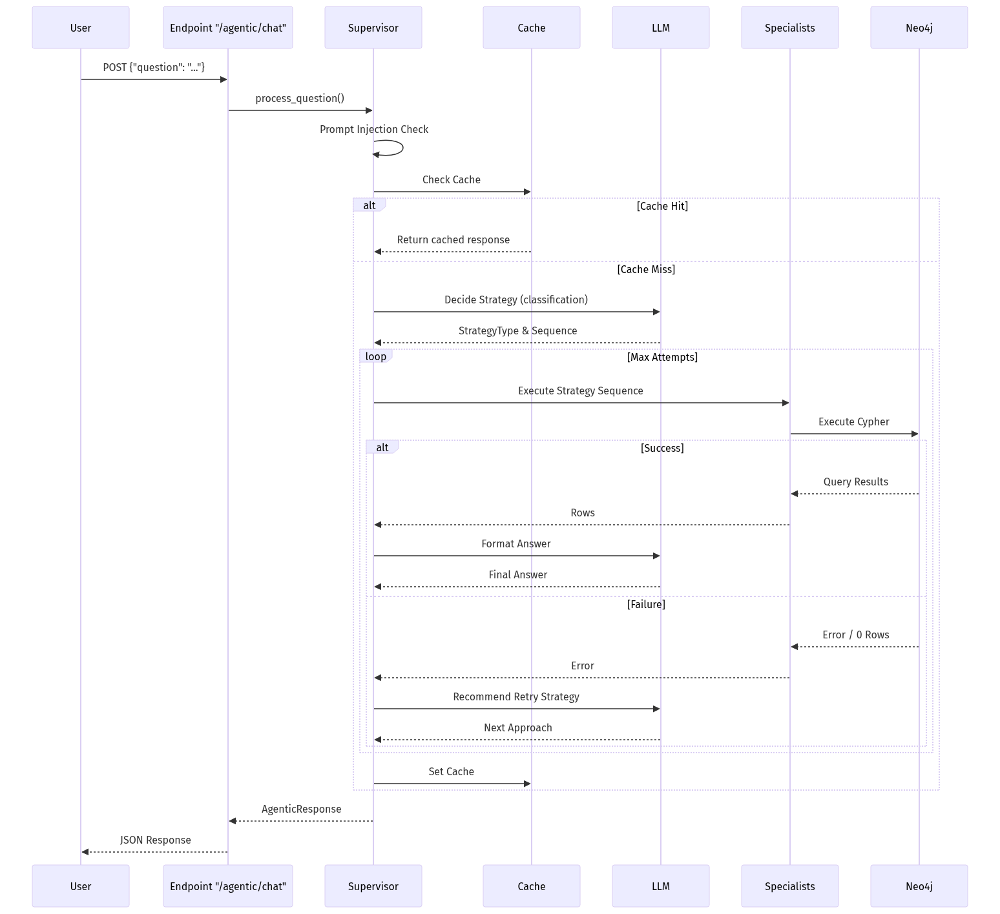

# Agentic Architecture Documentation

This document describes the internal workings of the multi-agent system, specifically focusing on the `/agentic/chat` endpoint and the behavior of the different AI agents.

## System Overview

The system is a **Structured Orchestrator with Specialist Workflow** agentic system. It combines the reasoning capabilities of Large Language Models (LLMs) with constrained, deterministic execution paths. This hybrid architectural design maximizes reliability when operating against a production graph database (Neo4j) while still utilizing autonomous decision-making logic.

## High-Level Workflow (`/agentic/chat`)

1. **Ingress**: The request hits the `/api/v1/agentic/chat` endpoint via FastAPI router logic.
2. **Security & Validation**: The input question undergoes a prompt-injection check and sanitization.
3. **Caching & Setup**: The system checks if a semantically identical query has already been answered and cached via `CacheManager`. If not, we restore/initialize the `AgentState` for conversation context.
4. **Autonomous Strategy Decision (Supervisor)**: The `Supervisor` uses an LLM to classify the user's intent into a specific `StrategyType` (e.g., `discovery_first`, `direct_query`, `schema_exploration`, or `aggregation`).
5. **Deterministic Sequence Execution**: Based on the chosen `StrategyType`, the `Supervisor` triggers a predetermined, rigid pipeline of AI Specialists. The LLM does *not* dynamically loop or decide the next agent on the fly; it simply executes the mapped Directed Acyclic Graph (DAG) sequence.
6. **Error Handling & Reflection (Autonomous)**: If execution fails (e.g., Cypher syntax error) or returns 0 rows, the sequence shifts into an autonomous reflection loop. A `ReflectionSpecialist` analyzes the failure context and autonomously selects a remedial path (expanding discovery, simplifying the query, or altering schema assumptions). The system will retry the execution until it succeeds or exhausts its attempts.
7. **Synthesis**: Upon successful query execution, the `Supervisor` formulates the database records into a natural language response.

## Agent Breakdown

The system is compartmentalized into one primary Orchestrator and six distinct Specialists:

### 1. Supervisor (Orchestrator)
- **Role**: Entry point, Strategy Planner, and Final Responder. 
- **Internal Loop**: Takes the user's question and past conversation context, calls the LLM to decide on a Strategy. Orchestrates the execution of the specialist sequence, intercepts failures to pass to the Reflection Specialist, and ultimately transforms the final raw data graph into a conversational answer.

### 2. Discovery Specialist
- **Role**: Entity Resolution.
- **Functionality**: Performs search (exact, fuzzy, full-text) over the Neo4j database to identify specific nodes or labels mentioned in the user's prompt (especially useful for acronyms or fuzzy matches where the prompt doesn't perfectly match the DB taxonomy).

### 3. Schema Reasoning Specialist
- **Role**: Schema Contextuation. 
- **Functionality**: Reviews available graph schema models and autonomously selects which database node and relationship types are strictly relevant to the current query intent, filtering out irrelevant database noise.

### 4. Query Planning Specialist
- **Role**: Pathfinding Planner.
- **Functionality**: Decides the depth and orientation of the Cypher traversal. It categorizes the requirement (e.g., a direct lookup, a 1-hop traversal, a multi-hop path, or an aggregation function).

### 5. Query Generation Specialist
- **Role**: Cypher Code Generation.
- **Functionality**: Loads dynamic strict syntax instructions from `.agent/skills/cypher_syntax/SKILL.md` to format valid, parameter-injected Cypher code that aims to execute the planned traversal on the reasoned schema over discovered entities.

### 6. Execution Specialist
- **Role**: Safe Executor. 
- **Functionality**: Does not use LLMs directly. Formats the parameters and executes the generated graph query via the Neo4j driver, bubbling exceptions or query payloads iteratively.

### 7. Reflection Specialist
- **Role**: Autonomous Debugger.
- **Functionality**: Is invoked only on exceptions or empty sets. Uses the LLM to "reflect" on *why* the Cypher failed based on the database engine response. It makes an autonomous recommendation of retry strategy.

## Autonomy & Hardcoding Evaluation

### **Rating: 6.5 / 10**

This system represents a balanced "Bounded Autonomy" approach, rating around 6.5 out of 10 on the pure autonomous agent scale. 

- **Autonomous Traits**: 
  - **Strategy Selection**: The LLM analyzes unknown string input to make upfront branching decisions without hardcoded regex/if-else chains.
  - **Reflection & Recovery**: The debugging logic dynamically adjusts queries on the fly utilizing errors as context for another LLM loop, akin to "Chain-of-Thought" reflection. 
  - **Schema Targeting**: Deciding which database node labels apply to the question is delegated to the AI's semantic mapping capability.
- **Hardcoded Limitations**: 
  - **Routing/Tool Calling Loops**: The architecture does *not* utilize ReAct (Reason + Act) continuous while/loop constructs where the agent decides which tools to invoke at each step. Instead, it relies on strict sequential tool sequences mapped tightly to specific Strategies. 
  - **Pipelined DAG**: The flow between agents is deterministic: `Discovery` is strictly invoked before `Schema Reasoning`, ensuring state doesn't enter weird infinite tool loops.

This combination trades some upper-ceiling generic agency for **Reliability and Security**, ensuring that a production Query Generator doesn't continuously hallucinate queries or stall out. It is highly optimized for complex schema querying where pure ReAct agents tend to fail entirely on Cypher.
